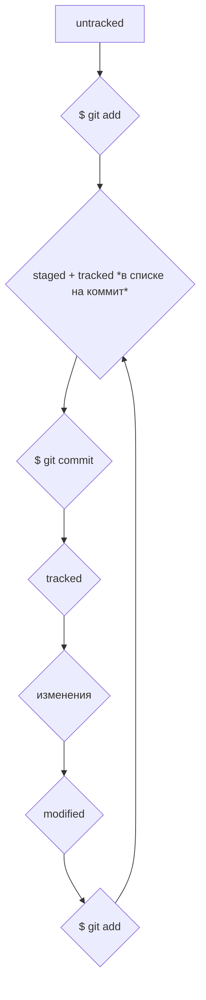

# Добро пожаловать в гайд по Git!
## Ниже будут представлены различные команды и инструкции для работы с Git.
----
### Важные обозначения:
- символ "**~**" (*тильда*) обозначает домашнюю директорию.
- символы "**..**" обозначают родительскую директорию.

----

```bash
$ pwd
```
(*print working directory*) выводит рабочую директорию.

----

```bash
$ cd
```
(*change directory*) с помощью данной команды происходит смена директории. Достаточно указать адресс нужной.

Например

```bash
$ cd ~
```
переместит вас в домашнюю директорию.

----

```bash
$ ls
```
(*list directory contents*) выводит содержимое директории.

----

```bash
$ ls -a
```
флаг *-a* выведет содержимое директории вместе со скрытыми файлами.

----

```bash
$ touch <file>
```
создание файла.

----

```bash
$ mkdir test-directory
```
создание директории.

----

```bash
$ cp <file> ~
```
копирование файла (*указывается имя файла и адресс директории, в которую необходимо скопировать файл*).

----

```bash
$ mv <file> ~
```
перемещение файла (*работает так же, как и cp*).

----

```bash
$ cat file.txt
```
чтение файла.

----

```bash
$ rm <file>
```
(**remove**) - удаление файла.

----

```bash
$ rmdir test-directory
```
(**remove directory**) - удаление директории.

----

```bash
$ rm -r test-directory
```
удаление директории со всем содержимым.

----

```bash
$ git init
```
создать репозиторий.

----

```bash
$ rm -rf .git
```
"*разгитить*" директорию.

----

```bash
$ git add <file>
```
добавить файл в список на коммит.

----

```bash
$ git add --all
$ git add .
```
флаг *--all* добавит в список на коммит все содержимое репозитория.

*.* добавит рабочую директорию в список на коммит.

Иными словами, обе комманды выполнят одно и тоже.

----

```bash
$ git log
```
выведет историю коммитов.

----

```bash
$ git log --oneline
```
благодаря флагу *--oneline* история комитов выведется в сокращенном формате.

----

```bash
$ git restore --staged <file>
```
убрать файл из списка на коммит.

----

```bash
$ git restore --staged .
```
сбросит из списка на коммит всю текущую папку.

----

```bash
$ git reset --hard <commit hash>
```
откатить коммит.

----

```bash
$ git restore <file>
```
откатить изменения в файле.
(*откатит файл от статуса modified к статусу staged*)

----
## **Важная информация о связывании локального и удаленного репозиториев**

- Для начала создаем локальный репозиторий с помощью команды:

```bash
$ git init
```

- Заходим на GitHub и создаем новый репозиторий там.
- Копируем его SSH.
- Связываем репозитории с помощью команды:

```bash
$ git remote add origin "URL"
# Вместо "URL" вставляем скопированный SSH
```

- Проверяем, что сделали все верно:

```bash
$ git remote -v
```

*Ура! Мы связали репозитории!*


Теперь при первой отправке изменений на удаленный репозиторий нужно воспользоваться командой:

```bash
$ git push -u origin master
# Вместо 'master' может быть 'main', в зависимости от названия главной ветки
```

В дальнейшем для этой же цели используем:

```bash
$ git push
```

----

## **Типичный жизненный цикл файла в Git**

- При добалении нового файла в репозиторий, он получает статус *untracked*.
- После команды:

```bash
$ git add
```
Он становится в список на коммит. То есть получает статус *staged*.
(Также теперь файл будет иметь статус *tracked*, ведь Git с этого момента отслеживает его изменения).
- После того как мы совершим коммит с помощью команды:

```bash
$ git commit -m "message"
# Вместо "message" должно быть описание коммита
```

У файла останется только статус *tracked*.
- Когда мы внесем в файл изменения, его статус изменится на *modified*.
- А когда мы в очередной раз поместим его в список на коммит с помощью команды:

```bash
$ git add
```

Весь приведенный цикл повторится.

